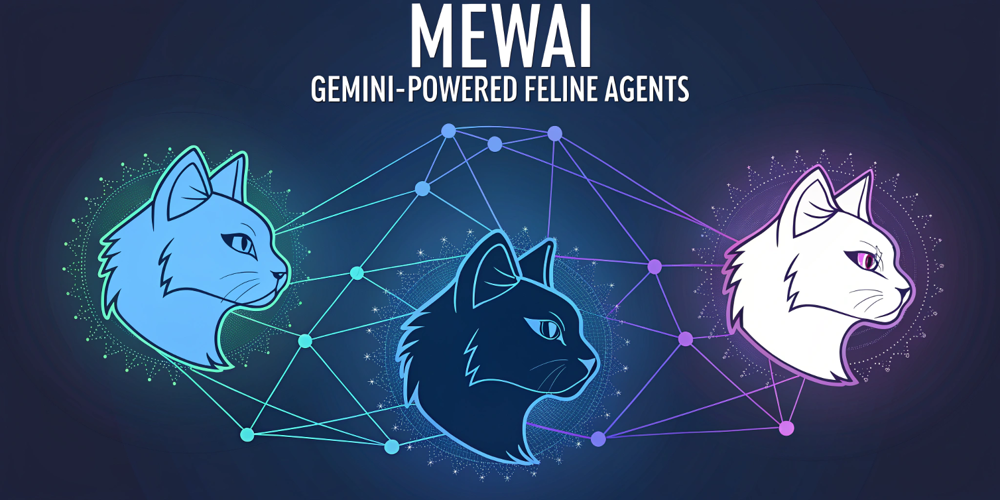

# 🐱 MewAI - Feline Agent Crew



## 📝 Description

MewAI is a multi-agent system powered by crewAI, utilizing "feline agents" enhanced by Gemini to automate blog content creation. These agents collaborate on tasks involving content drafting, content review and content adaptions for instagram, linkedin and twitter.

## 🚀 Features

- Multi-agent system built with crewAI
- Integration with Gemini for natural language processing
- Automated workflow for content creation
- Specialized agents:
  - ✍️ Content Writer
  - 📋 Reviewer and Editor
  

## 🛠️ Requirements

- Python >=3.10, <=3.13
- UV for dependency management
- Necessary API credentials (Gemini)

## ⚙️ Installation

Create a virtual environment with Python version between 3.10 and 3.13:

```bash
py -3.10 -m venv venv
# Activate the environment
venv\Scripts\activate
```

Install dependencies:

```bash
pip install -r requirements.txt
```

## 🔧 Configuration

1. Create a `.env` file in the project's root directory.
2. Add the necessary environment variables:

```env
MODEL=gemini/gemini-1.5-flash # or another model of your choice
GEMINI_API_KEY=your_api_key
```

## 🏗️ Project Structure

```git
MewAI/
├── src/
│ ├──config/
│ │ ├──agents.yaml
│ │ └──tasks.yaml
│ ├──knowledge/ <--  Location to store the RAG DB
│ ├──assets/ <-- images and other assets
│ ├── tools/
│ │ ├── rag_tool.py  <- RAG tools
│ │ └── scraper_tool.py <- Scraper tools
│ ├── crew.py
│ ├── main.py
│ └──  __init__.py
├── .env
├── requirements.txt
└── pyproject.toml
├── venv <-- you need create one
└── README.md
```

## 🤝 Contributing

Contributions are welcome! Please follow these steps:

1. Fork the project.
2. Create a branch for your feature (`git checkout -b feature/AmazingFeature`).
3. Commit your changes (`git commit -m 'Add: AmazingFeature'`).
4. Push to the branch (`git push origin feature/AmazingFeature`).
5. Open a Pull Request.

## 📄 License

This project is licensed under the MIT License

## 👥 Author

- David Silvera

## 🙏 Acknowledgements

- [crewAI](https://github.com/joaomdmoura/crewAI)
- LLMOps developer community

## 📚 Additional Documentation

For more information on using and configuring the agents, see the [complete documentation](docs/README.md).

## 🔮 Roadmap

- [ ] Implementation of additional specialized agents
- [ ] Improvement of the natural language processing system
- [ ] Integration with more data sources
- [ ] Content quality evaluation system
- [ ] Web user interface
